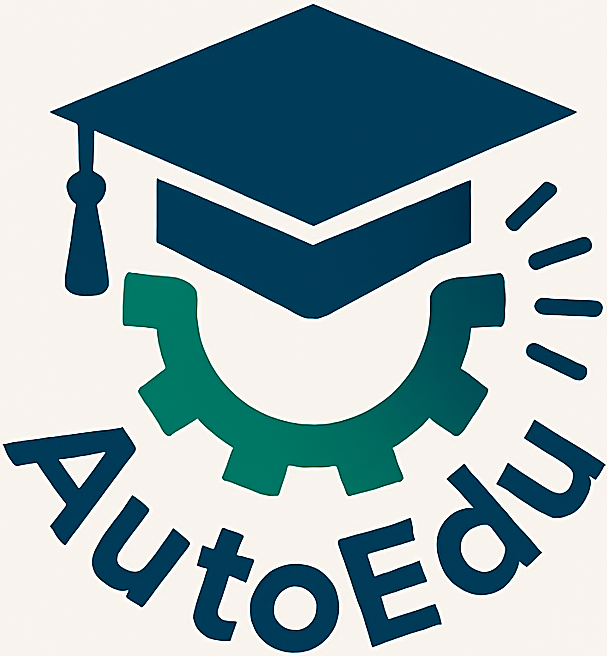

# AutoEdu

  

**AutoEdu (Automation in Education)** is a project for the automation of web-based management tools and portals used in Education.

---

## 🚀 Latest Release

**Version:** `v1.0.0`  
**Release Date:** `2025-10-28`  
**Highlights:**
- Initial release of AutoEdu with support for UDISE Student Import Module

👉 See full Release [here](https://github.com/AshishNamdev/AutoEdu/releases/tag/AutoEdu_v1.0.0)
👉 See full changelog [here](./CHANGELOG.md)

---

## 🌐 Supported Portals
- [UDISE](https://sdms.udiseplus.gov.in/)
- [MPBSE](https://mpbse.mponline.gov.in/MPBSE/MPBSE)
- [Education Portal 3.0](https://sederp.educationportal3.in/)
